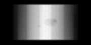
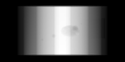
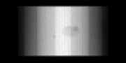
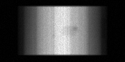

# 🧠 Physics-Aware CT Simulation & Industrial Defect Modeling

> A production-grade, physics-informed pipeline for generating realistic cone-beam CT datasets with industrial defects and scanner artefacts.

---

## 🚀 Why This Project Matters

Modern CT-based inspection systems rely heavily on **data-driven models**, yet real labeled data is scarce, expensive, and often proprietary.

This project bridges that gap by:
- Simulating **high-fidelity CT physics**
- Generating **label-rich industrial defect datasets**
- Enabling **ML + reconstruction research in controlled environments**

---

## 🏗️ End-to-End Pipeline

```
3D Phantom (μ)
   ↓
Cone-beam Projection
   ↓
Beer–Lambert Physics
   ↓
Noise + Artefacts
   ↓
Detector Measurements
```

---
## Sample Outputs

<p align="center">
  
  
  
</p>

<p align="center">
  <b>Phantom</b> &nbsp;&nbsp;&nbsp;&nbsp;
  <b>Clean Projection</b> &nbsp;&nbsp;&nbsp;&nbsp;
  <b>Noisy Projection</b>
</p>

<p align="center">
  Ground truth vs ideal vs physics-aware noisy CT projections
</p>

---

## CT Geometry

| Parameter | Description |
|----------|------------|
| Nx, Ny, Nz | Volume resolution |
| SID | Source → Isocenter |
| SDD | Source → Detector |
| n_angles | Number of projections |
| det_rows, det_cols | Detector resolution |

---

## Industrial Phantom

Multi-material simulation:
- CFRP (base)
- Aluminium / Steel layers
- Tungsten / Lead inclusions

---

## Defect Library

| Defect | Description |
|------|------------|
| Pores | Random spherical voids |
| Micro-porosity | Clustered defects |
| Cracks | Tilted ellipsoids |
| Inclusion | Dense foreign material |
| Delamination | Thin planar separation |
| Corrosion | Smooth degradation |

---

## Noise & Artefacts (Physics-Aware)

| Effect | Model |
|------|------|
| Beam Hardening | p' = p + αp² | 
| Poisson | Photon statistics |
| Gaussian | Electronics noise |
| Rings | Detector bias |
| Scatter | Low-frequency blur |

---

## 📦 Outputs

| File | Description |
|-----|------------|
| phantom.npy | Ground truth |
| projections_clean.npy | Ideal |
| projections_noisy.npy | Realistic |
| geometry.json | Scanner config |

---

## 🧪 Experiment Tracking

### Variant: Phantom Volume Parameters

- Same Geometry, Materials and Defects
- Changing Gaussian Smoothening, Corrosion Factor

| Parameter | Low Blur | High Blur |
|----------|------|-------|
| Smoothening | 0.4 | 0.7 |
| Corrosion Factor | 0.1 | 0.14 |

<p align="center">
  
  
</p>

<p align="center">
  <b>Phantom Corr 0.1 Smooth 0.4</b> &nbsp;&nbsp;&nbsp;&nbsp;
  <b>Phantom Corr 0.14 Smooth 0.7</b> &nbsp;&nbsp;&nbsp;&nbsp;
</p>

<p align="center">
  Phantom Low Blur vs Phantom High Blur
</p>

### Variant: Noise Parameters

- Same Phantom Volume
- Changing Noise Setting

| Noise Preset | I₀ (photon count) | σ_e (Gauusian) | Ring strength | Beam hardening | Reported SNR |
|--------|-------------|-----|---------------|----------------|---------------|
| none   | 10⁹         | 0   | 0             | 0              |~14000         |
| low    | 50 000      | 0.002 | 0.5 %       | 0 %            |30.3           |
| medium | 10 000      | 0.005 | 1.0 %       | 3 %            |10.5           |
| high   | 2 000       | 0.015 | 2.0 %       | 6 %            |4.9            |

Applied in order: beam hardening → Poisson → Gaussian → rings.

<p align="center">
  
  
  
  
</p>

<p align="center">
  <b>Noiseless</b> &nbsp;&nbsp;&nbsp;&nbsp;
  <b>Low Noise</b> &nbsp;&nbsp;&nbsp;&nbsp;
  <b>Medium Noise</b> &nbsp;&nbsp;&nbsp;&nbsp;
  <b>High Noise</b>&nbsp;&nbsp;&nbsp;&nbsp;
</p>

<p align="center">
  Physics-aware Projections with Different Noise Conditions
</p>


## Applications

- CT denoising (DL models)
- Defect detection (classification/segmentation)
- Sparse-view reconstruction
- Physics-aware generative models
- Sim-to-real domain adaptation

---

## Key Technical Highlights

- Physics-consistent forward model
- Signal-dependent noise (Poisson)
- Industrial defect realism
- Modular pipeline (extensible)

---

## Roadmap

- Polychromatic modeling μ(E)
- Detector PSF
- Focal spot blur
- Learned noise models
- Real-data calibration

---

## Author

**Ayush Chauhan**  
Applied ML | CT Reconstruction | Industrial AI  

---

## ⭐ If you find this useful

Star ⭐ the repo and feel free to connect!
